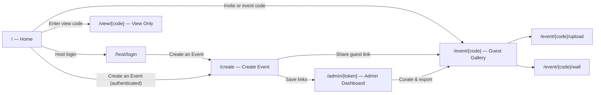

# Photo Album — User Roadmap

A step-by-step guide for every role in the app: **hosts (admins)**, **guests**, and **view-only visitors**. No accounts or passwords — access is controlled by short event codes and links.

---

## Who Uses What

| Role | How they join | What they can do |
|------|---------------|------------------|
| **Host (Admin)** | Host login + admin link from event creation | Create events, manage uploads, guest list, export album |
| **Guest** | Personal invite code, event code, guest link, or QR | Upload photos/videos/stories, react, comment |
| **View-only visitor** | View-only link or 8-char code | Browse gallery only — no upload or engagement |



---

## Host Roadmap (Admin)

Your journey from setting up the event to preserving memories after it ends.

### Phase 1 — Before the event

| Step | Where | Action | Tip |
|------|-------|--------|-----|
| 1 | `/host/login` | Log in with the platform host secret | Required when `HOST_ACCESS_SECRET` is configured |
| 2 | `/` or `/create` | Click **Create an Event** | Or go directly to `/create` after host login |
| 3 | `/create` | Fill in event name, access mode, optional guest list & event code | Date helps calendar navigation default |
| 4 | Success screen | **Save all three links immediately** | Admin link is shown **once only** — bookmark it now |
| 5 | Success screen | Copy guest link or download/display QR codes | Two QR codes: upload (guest) and view-only |
| 6 | Admin dashboard | Customize **Event Moments** | Defaults: Ceremony, Cocktail Hour, Reception, Dance Floor |
| 7 | Admin dashboard | Add **Photo Challenges** (optional) | e.g. "Best dance move", "Candid laughter" |
| 8 | `/admin/{token}/guests` | Manage invite list (optional) | Add/edit households and personal invite codes |

**Critical:** If you lose the admin link, it cannot be recovered. Save it in your bookmarks, password manager, or notes before leaving the success page.

---

### Phase 2 — During the event

| Step | Where | Action | Tip |
|------|-------|--------|-----|
| 1 | Venue | Display the **Guest Upload QR** on a sign or screen | Guests scan → upload instantly from their phones |
| 2 | Remote guests | Share guest link via text, email, or group chat | 8-char code also works on the home page |
| 3 | Spectators | Share **View Only** link or QR | They can browse without uploading |
| 4 | Admin dashboard | Monitor upload stats (photos, videos, stories) | Refresh to see new contributions |
| 5 | Admin dashboard | Delete unwanted or duplicate uploads | Removes from gallery, database, and storage |
| 6 | Admin dashboard | Toggle photo challenges on/off | Deactivated prompts hide from guest gallery |

---

### Phase 3 — After the event

| Step | Where | Action | Tip |
|------|-------|--------|-----|
| 1 | Admin dashboard | Review **Media** grid and **Guests** list | See who contributed and how much |
| 2 | Admin dashboard | Click **Export** | Downloads ZIP with all media + `metadata.json` |
| 3 | Admin dashboard | Re-copy guest/view links from **Share Event** | Links remain valid — albums do not expire |
| 4 | Anytime | Open **View Gallery** from admin | See the guest experience firsthand |

---

### Admin dashboard map

```
/admin/{adminToken}
├── Event overview          → Name, host, date, media counts
├── Share Event             → QR codes + copyable guest, view-only, admin links
├── Export Album            → ZIP download (all files + metadata)
├── Event Moments           → Add/delete chapters (Ceremony, Reception, …)
├── Photo Challenges        → Add/toggle/delete prompts for guests
├── Media                   → Post grid with per-item delete
└── Guests                  → Joined guests + link to invite management
    └── /guests             → Invite list CRUD (personal codes)
```

---

## Guest Roadmap

Your journey from joining an event to sharing and engaging with memories.

### Step 1 — Join the event

Choose any one:

- **Enter your personal invite code** on the home page and pick your name
- **Enter the event code** and your name (when the host enabled event-code access)
- **Scan the QR code** at the venue
- **Open the guest link** the host shared (e.g. `/event/ABC12345`)

After login you land on the **Gallery** with bottom navigation: **Gallery · Upload · Guests**.

---

### Step 2 — Enter your name (if prompted)

| What happens | Why |
|--------------|-----|
| Invite/event-code login sets your name automatically | Skips the prompt in most cases |
| A prompt may still appear without a session | Labels uploads, reactions, and comments |
| Tap **Not you?** to switch | Clears session and returns home |

---

### Step 3 — Upload memories

Tap **Upload** in the bottom nav (`/event/{code}/upload`).

| Tab | What to do | Notes |
|-----|------------|-------|
| **Photos & Videos** | Drag files or tap to browse | Add optional caption; select a moment |
| **Text** | Write a written memory | Appears as a card in the timeline |
| **Audio** | Tap Record → speak → submit | Appears as an audio player in the gallery |

**Optional tags:**
- **Moment** — tag upload to a chapter (Ceremony, Reception, etc.)
- **Photo challenge** — tap a prompt in the gallery first; upload opens with it pre-selected

After uploading, use **View my uploads** to see only your contributions.

---

### Step 4 — Browse the gallery

Tap **Gallery** in the bottom nav.

| Feature | How to use |
|---------|------------|
| **Timeline** | Media grouped by day with sticky date headers |
| **Calendar strip** | Tap a day to jump to that date |
| **Moment filter** | Dropdown to show only one chapter |
| **My uploads** | Tap your avatar in the header, or `?mine=1` |
| **Photo challenges** | Active prompts shown with response counts; tap to upload for that prompt |
| **Lightbox** | Tap any photo or video for full-screen view |

---

### Step 5 — Engage with others' uploads

In the lightbox (photos and videos only):

| Action | How |
|--------|-----|
| **React** | Tap ❤️ 😂 😮 😢 👏 — tap again to remove |
| **Comment** | Type a message and submit |

Reactions and comments are tied to your guest name.

---

### Step 6 — See who's contributing

Tap **Guests** in the bottom nav (`/event/{code}/wall`).

- See contributor avatars (initials) with upload counts
- Only guests with at least one upload appear
- Tap a guest to filter the gallery to their uploads

---

### Guest navigation cheat sheet

```
/event/{code}
├── Gallery (default)     → Timeline, filters, lightbox, reactions
├── Upload                → Photos, videos, text, audio
└── Guests                → Contributor wall → tap to filter gallery

Header
├── Event name
├── Your avatar           → Tap for "My uploads"
└── "Not you?"            → Switch guest identity
```

---

## View-Only Visitor Roadmap

For family, friends, or anyone who should browse without contributing.

| Step | Action |
|------|--------|
| 1 | Open view-only link (`/view/{code}`) or enter view code on home page |
| 2 | Browse gallery timeline — no name prompt required |
| 3 | Use calendar navigation and moment filters to explore |
| 4 | Tap photos/videos for lightbox — **no reactions or comments** |

View-only visitors cannot upload, react, comment, or appear on the guest wall.

---

## Event Lifecycle Timeline

A combined view of when each role acts:

```
BEFORE EVENT          DURING EVENT              AFTER EVENT
─────────────         ─────────────             ────────────
Host creates event    Guests scan QR & upload   Host exports ZIP
Host saves admin link Host monitors dashboard   Guests keep browsing
Host sets moments     Host curates (delete)     Links stay active
Host adds prompts     Guests react & comment    No expiry (v1)
                      View-only guests browse
```

---

## Access & Permissions Matrix

| Capability | Guest | View-only | Admin |
|------------|:-----:|:---------:|:-----:|
| Browse gallery | ✅ | ✅ | ✅ |
| Upload photos/videos | ✅ | ❌ | ❌ |
| Text / audio memories | ✅ | ❌ | ❌ |
| Reactions & comments | ✅ | ❌ | ❌ |
| Guest wall | ✅ | ❌ | ✅ (via link) |
| Delete media | ❌ | ❌ | ✅ |
| Manage moments/prompts | ❌ | ❌ | ✅ |
| Export ZIP | ❌ | ❌ | ✅ |
| See admin link | ❌ | ❌ | ✅ |

---

## Common Questions

### "I lost my admin link. Can I get it back?"
No. The admin link is shown once at event creation. Create a new event if needed, or ensure you saved it before leaving the success page.

### "Can I change my guest name?"
Yes. Tap **Not you?** in the event header or upload page. You'll be prompted to enter a new name.

### "Why can't I upload on the view-only link?"
View-only links are intentionally read-only. Ask the host for the **guest upload link** instead.

### "My photo isn't showing in the gallery yet."
Wait a few seconds and refresh. Large uploads may take longer. Check that upload completed (progress bar reached 100%).

### "Can guests see the admin dashboard?"
No. The admin token is separate and never shown to guests.

### "Does the album expire?"
No — galleries are permanent by default in v1.

---

## Quick URL Reference

| URL | Who | Purpose |
|-----|-----|---------|
| `/` | Everyone | Invite login, event code, host login, create event |
| `/host/login` | Host | Platform host authentication |
| `/create` | Host | Create a new event |
| `/event/{accessToken}` | Guest | Gallery with upload & engagement |
| `/event/{accessToken}/upload` | Guest | Upload page |
| `/event/{accessToken}/wall` | Guest | Contributor wall |
| `/view/{viewToken}` | View-only | Read-only gallery |
| `/admin/{adminToken}` | Host | Admin dashboard |
| `/admin/{adminToken}/guests` | Host | Manage invite list and joined guests |

---

## Related Documentation

- [Getting Started Guide](getting-started.md) — Setup (`make setup`), testing, and developer walkthrough
- [Plan](plan.md) — Full specification and technical architecture
- [AGENTS.md](../AGENTS.md) — Agent conventions and Makefile reference
- [QA Remediation](qa-remediation.md) — Security and UX fix history
